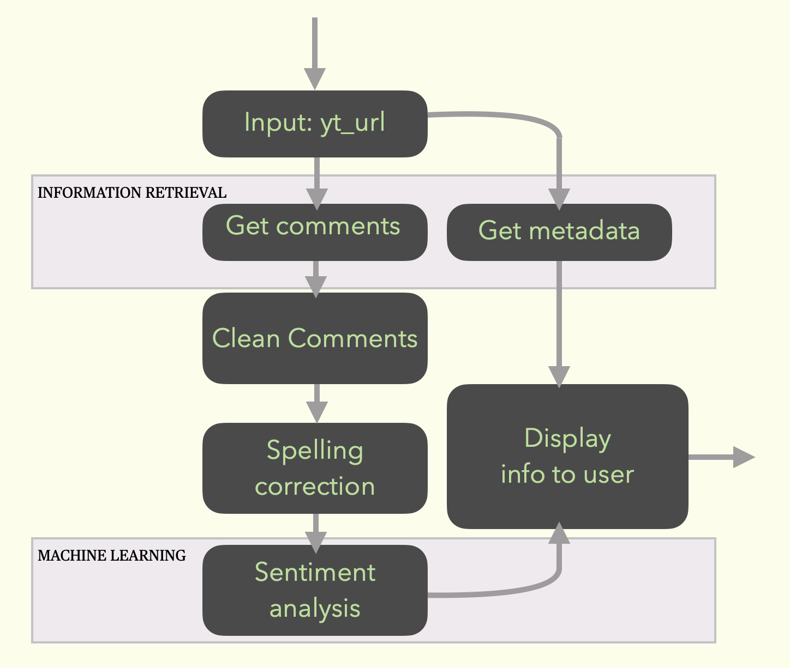

# YouTube Comments Analysis

This project analyzes the sentiment of YouTube video comments to provide insights into user engagement and opinions.
## Installation

Clone the repository and install the required dependencies:

```bash
git clone https://github.com/SimoneAvellino/CMiner

cd yt_comments_analysis

pip install -r requirements.txt
```


## Usage

```bash
python main.py <youtube_video_link> [--number_of_comments N]
```

- `<youtube_video_link>`: The URL of the YouTube video you want to analyze.
- `--number_of_comments N` (optional): Limits the number of comments analyzed. Useful for videos with a large number of comments to speed up processing.

## Example

```bash
python main.py https://www.youtube.com/watch\?v\=niKMwO8NIiM 
```

```bash
Video Title:
     NLTK Tutorial 03: Tokenization | NLTK Tokenization | NLTK | Python
Video Description:
     NLTK Tutorial 03: Tokenization | NLTK Tokenization
     | NLTK | Python  GitHub JupyterNotebook:
     https://github.com/siddiquiamir/NLTK-Text-Mining
     GitHub Data: https://github.com/siddiquiamir/Data
     About this video: In this video, you will learn
     how to about Tokenization in NLTK  Large Language
     Model (LLM) - LangChain LangChain: https://www.you
     tube.com/playlist?list=PLBSCvBlTOLa_WxDWdDoHSP3u2C
     dGImtwM  Large Language Model (LLM) - LlamaIndex
     LlamaIndex: https://www.youtube.com/playlist?list=
     PLBSCvBlTOLa-vUt7mCECzaJjJEjos6K-l  Machine
     Learning Model Deployment ML Model Deployment: htt
     ps://www.youtube.com/playlist?list=PLBSCvBlTOLa9XS
     cezTGcOsXJidvmFQm5o  Spark with Python (PySpark)
     PySpark: https: https://www.youtube.com/playlist?l
     ist=PLBSCvBlTOLa9oTtXH3vNaaw7jT9kXFwjb  Data
     Preprocessing (scikit-learn) Data Preprocessing
     Python: https://www.youtube.com/playlist?list=PLBS
     CvBlTOLa8_IHxi8x2P9ySJgHWGhppn  Social Media Links
     YouTube:
     https://www.youtube.com/c/statswire Twitter (X) :
     https://twitter.com/StatsWire  #llm #ai #genai
     #generativeai #statswire #pyspark #python
     #pythonprogramming #pythontutorial
     #machinelearning #datascience
     #naturallanguageprocessing #nlp  #nltk
Stats on comments:
     Number of comments retrieved (all): 12
     Number of likes: 188
     Number of views: 13748
Evaluating comments: 100%|█████████████████████████████████████████████████████████████████████████████████████████████████| 12/12 [00:00<00:00, 111.89comment/s]
Sentiment Analysis:
     Positive: 75.0 %
     Negative: 8.333333333333332 %
     Neutral: 16.666666666666664 %
```

## Implementation details



- The diagram above illustrates the workflow: comments are fetched from YouTube, processed for sentiment analysis, and results are summarized.

The machine learning model is trained on a [dataset on kaggle](https://www.kaggle.com/datasets/atifaliak/youtube-comments-dataset)
